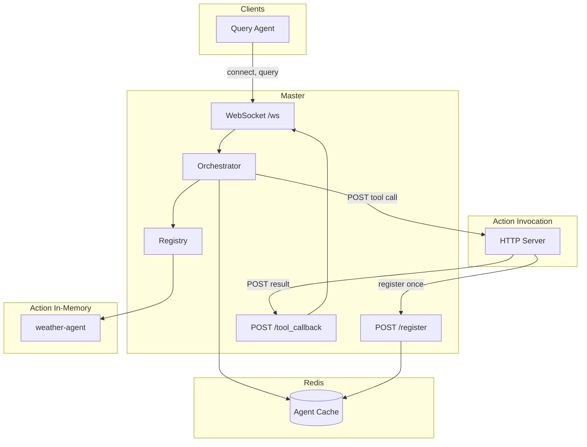

# OpenAgent

Central **master** coordinates **query agents** (send questions) and **action agents** (expose tools). The master uses **GPT-4o-mini** to decide whether to answer directly or call a tool. Action agents can be **in-memory** (WebSocket, live only while connected) or **invocation** (HTTP URL stored in Redis, survive master restart).

## Architecture



- **Query agent**: Connects via WebSocket, sends queries, receives `query_result`.
- **In-memory action agent**: Connects via WebSocket, registers tools, receives `tool_call` over WS. Not stored in Redis; gone when master or agent restarts.
- **Invocation action agent**: Runs an HTTP server. Registers once via `POST /register` (or WS with `invocation_url`). Master stores `invocation_base_url` + per-tool `endpoint` in Redis. On tool call, master POSTs to `{base}{endpoint}`; agent POSTs result to master `/tool_callback`. Survives master restart; master health-checks `GET {base}/health` on startup and `/refresh`.

## Setup

```bash
source ~/base/bin/activate   # or your venv
pip install -r requirements.txt
```

Copy `.env.example` to `.env` and set:

```bash
OPENAI_API_KEY=sk-...
REDIS_URL=redis://localhost:6379
MASTER_BASE_URL=http://127.0.0.1:8000
```

Optional for invocation agent: `INVOCATION_BASE_URL`, `INVOCATION_PORT`, `MASTER_WS`.

## Configuration (`config.py`)

All settings are read from the environment (and from `.env` via dotenv). Defaults are below.

| Env variable | Default | Description |
|--------------|---------|-------------|
| **Master** | | |
| `REDIS_URL` | `redis://localhost:6379` | Redis connection URL for agent cache and session store. |
| `REDIS_AGENT_TTL_SECONDS` | `86400` (24h) | TTL for cached (invocation) agent keys. Refreshed when the agent is used. |
| `REDIS_SESSION_TTL_SECONDS` | `86400` (24h) | TTL for session keys; conversation history expires after this. |
| `MASTER_BASE_URL` | `http://127.0.0.1:8000` | Base URL of the master (HTTP). Used for tool callback URL and health. |
| `OPENAI_API_KEY` | — | **Required.** OpenAI API key for orchestrator and summarizer. |
| **Orchestrator** | | |
| `ORCHESTRATOR_MODEL` | `gpt-4o-mini` | Model for decide (answer_directly vs call_tool) and for synthesis when not overridden. |
| `ORCHESTRATOR_CONTEXT_MAX_TOKENS` | `12000` | Max tokens for orchestrator context (summaries + tail + tools + query). When exceeded, older turns are summarized. |
| `ORCHESTRATOR_RECENT_TURNS` | `8` | Number of recent raw turns to keep in full before summarizing the rest. |
| `SUMMARIZER_MODEL` | *(none)* | Model for summarizing long context. If unset, uses `ORCHESTRATOR_MODEL`. |
| **Timeouts (seconds)** | | |
| `HEALTH_CHECK_TIMEOUT` | `2.0` | Timeout for master health checks (e.g. invocation agent `/health`). |
| `TOOL_CALL_TIMEOUT` | `30.0` | Max time to wait for a tool result (WS or HTTP callback) before failing the query. |
| `TOOL_INVOKE_HTTP_TIMEOUT` | `2.0` | Timeout for master POST to invocation agent's tool endpoint. |
| **Agents (client → master)** | | |
| `MASTER_WS` | `ws://127.0.0.1:8000/ws` | WebSocket URL used by query/action agents to connect to the master. |
| `WS_CONNECT_TIMEOUT` | `10.0` | Timeout for WebSocket connect. |
| `WS_REGISTRATION_TIMEOUT` | `10.0` | Timeout for registration response after register message. |
| `QUERY_RESPONSE_TIMEOUT` | `60.0` | Timeout for query agent to receive `query_result` after sending `query`. |
| `HTTP_REGISTER_TIMEOUT` | `10.0` | Timeout for invocation agent HTTP POST to `/register`. |
| **Invocation agent (demo)** | | |
| `INVOCATION_PORT` | `9000` | Default port for demo invocation agent. |
| `INVOCATION_HOST` | `127.0.0.1` | Host for invocation base URL. |
| `INVOCATION_BASE_URL` | `http://{INVOCATION_HOST}:{INVOCATION_PORT}` | Full base URL when not set explicitly. |

## Run

**Terminal 1 – Redis** (required for invocation agents and for master to list known agents)

```bash
redis-server
```

**Terminal 2 – Master** (WebSocket on 8000, HTTP APIs)

```bash
uvicorn master.app:app --reload --reload-dir master --reload-dir protocol --reload-dir openagent --host 0.0.0.0 --port 8000
```

Only `master/`, `protocol/`, and `openagent/` are watched; edits in `agents/` do not restart the server.

**Terminal 3 – Action agent (in-memory)**

```bash
python agents/action_weather.py
```

Stays connected via WebSocket; tools are available only while this process and the master are running.

**Terminal 4 – Action agent (invocation)** (optional)

```bash
python agents/demo_invocation_agent.py
```

Starts an HTTP server and registers with the master once. No WebSocket. Master invokes via HTTP; agent survives master restart (re-register or rely on Redis).

**Terminal 5 – Query agent**

```bash
python agents/query_demo.py
```

Sends example queries (including a long-task that exercises **progress**); the orchestrator calls the weather or echo/get_time/long_task tools. Watch the master terminal for `progress (WS)` or `progress (HTTP)` lines.

## Master HTTP endpoints

| Endpoint | Description |
|----------|-------------|
| `GET /health` | Liveness |
| `GET /agents` | All agents (tracker + Redis cache), with connection type and status |
| `GET /refresh` | Re-fetch Redis cache and run health checks on invocation agents; returns and prints UP/DOWN |
| `POST /register` | Register an action agent by `invocation_base_url` + tools (with optional per-tool `endpoint`). Redis only. |
| `POST /tool_callback` | Used by invocation agents to post tool results back (call_id, success, result/error) |
| `POST /tool_progress` | Optional: invocation agents POST progress (call_id, progress) during long tool runs |
| `GET /tool_progress/{call_id}` | Optional: poll latest progress for a tool call |

WebSocket at `/ws`: connect, send `register`, then `query` (query agents) or receive `tool_call` (action agents).

## Invocation agent contract

- **Health**: Expose `GET {invocation_base_url}/health` → 200 and e.g. `{"status":"ok"}`.
- **Tool call**: Master POSTs to `{invocation_base_url}{tool.endpoint}` with body:
  `call_id`, `tool_name`, `arguments`, `callback_url`.
- **Result**: Agent POSTs to `callback_url` with `call_id`, `success`, and either `result` or `error`.

Each tool can have its own `endpoint` (e.g. `/run`, `/get_time`).

## Project layout

| Path | Description |
|------|-------------|
| `protocol/` | Wire protocol (Pydantic: register, query, tool_call, tool_result, ToolSchema with optional `endpoint`) |
| `openagent/` | Client helpers: `AgentClient`, `connect_master`, `run_action_agent`, `register_invocation_agent`, `ToolSchema` |
| `master/` | FastAPI app, WebSocket, Redis cache, orchestrator, registry, tracker |
| `agents/` | Examples: `action_weather.py` (in-memory), `demo_invocation_agent.py` (invocation), `query_demo.py` |

## Message contract (WebSocket)

- **Agent → Master**: `register`, `query`, `tool_result`, `ping`
- **Master → Agent**: `registered`, `query_result`, `tool_call`, `pong`, `error`

See `protocol/messages.py` for full fields. Register may include `invocation_url` (legacy) for action agents; then the master stores them in Redis and invokes via HTTP.

## Session management

Conversations are **session-scoped**. The master creates or reuses a session per query so multi-turn context is preserved.

- **Storage**: Redis key `session:{session_id}`; value is a JSON array of **turns**. Sessions expire after `REDIS_SESSION_TTL_SECONDS` (default 24h).
- **Session ID**: First query in a conversation omits `session_id`; the master creates one (UUID) and returns it in `query_result.session_id`. Subsequent queries send that `session_id` so the master loads the same turns.
- **Turns**: Each turn is a dict: `query`, `query_id`, `decision` (`"answer_directly"` or `"call_tool"`), and for tool calls `tool_agent_id`, `tool_name`, `tool_args`, `result`/`error`. Summary turns (see below) have `decision: "summary"`, `summary`, and `covers_through_index`.
- **Create/load/append**: `master/session_store.py` — `create_session`, `load_session`, `append_turn`. The orchestrator loads turns before each decision and appends a new turn after each answer or tool result.

A **sample session file** (raw turns plus summary turns as stored in Redis) is at [`experiments/results/samle_session_file.json`](experiments/results/sample_session_file.json). It shows interleaved raw turns (weather queries, tool calls, direct answers) and summary turns with `covers_through_index`.

---

## Summary logic (long context)

When building orchestrator context, we keep token usage bounded by **summarizing older turns** and **persisting summaries in the session**.

- **Context for each query** = **all previous summary turns** (in order) + **all raw turns after the last summary**. So older conversation is compressed into summary blocks; only the “tail” after the last summary is sent in full.
- **When over limit** (`ORCHESTRATOR_CONTEXT_MAX_TOKENS`): we take the raw tail, keep the last `ORCHESTRATOR_RECENT_TURNS` turns in full, and summarize the rest with the same orchestrator model. We append a **summary turn** to the session: `{"decision": "summary", "summary": "<text>", "covers_through_index": N}`. `covers_through_index` is the index (in the full session list) of the last turn that summary covers; “raw turns after last summary” are all turns with index > last summary’s `covers_through_index`.
- **Config**: `ORCHESTRATOR_CONTEXT_MAX_TOKENS` (default 12000), `ORCHESTRATOR_RECENT_TURNS` (default 8). Lower them to trigger summarization earlier (e.g. 1200 and 2 for testing).
- **Token counting**: `master/session_context.py` uses tiktoken (`cl100k_base`). Summarization and message building live in `build_orchestrator_messages_async`; the master appends the returned summary turn to the session when present.

---

## Clearing Redis

To reset cached (invocation) agents:

```bash
redis-cli FLUSHDB
```

Then restart the master; invocation agents must re-register.
